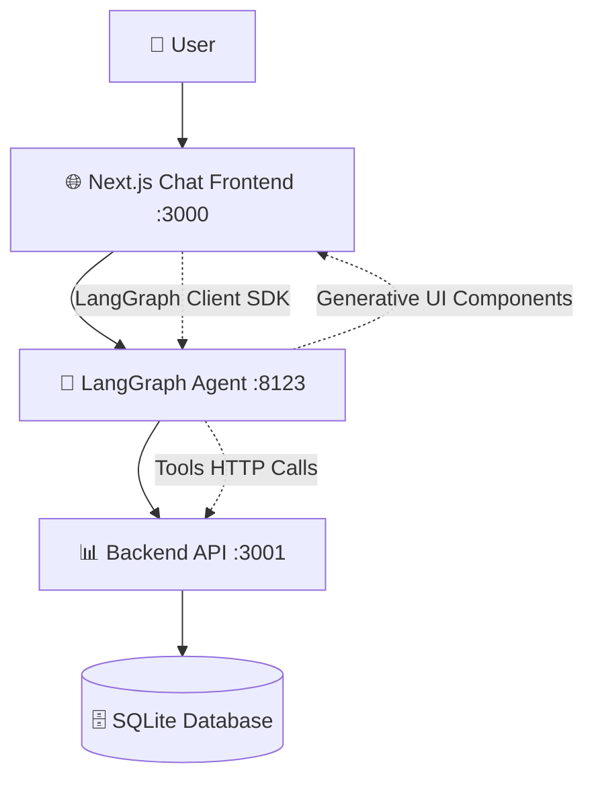

# 🛫 Trip Planner Agent - Desafio Técnico Blis AI

> Sistema completo de **self-booking** de voos e hotéis via Chat UI com arquitetura microserviços, utilizando **LangGraph + Generative UI + Clean Architecture**

## 🏗️ Arquitetura do Sistema

### Microserviços Implementados
[🎥 Ver vídeo de exemplo](./docs/exemplo.mp4)



1. **� Chat Frontend** (Next.js 14 + App Router)

   - Interface conversacional moderna
   - LangGraph Client SDK integration
   - Thread management e streaming real-time

2. **🤖 LangGraph Agent** (Multi-agent system)

   - Supervisor agent + agentes especializados
   - Generative UI rendering
   - Tools tipadas com schemas Zod

3. **📊 Backend API** (Clean Architecture + Prisma)
   - Domain-driven design
   - Simulação de latência e falhas
   - Persistência SQLite com seeds realistas

## 🚀 Como Rodar (3 Terminais)

### Pré-requisitos

- **Node.js 18+**
- **NPM/PNPM/Yarn**
- **OPENAI_API_KEY** (fornecida no desafio)

### Setup Completo (5 minutos)

```bash
# 1️⃣ TERMINAL 1: Backend API
cd chat-backend
npm install
npm run dev           # 🚀 http://localhost:3001

# 2️⃣ TERMINAL 2: LangGraph Agent
cd agent
npm install
cp .env.example .env  # Configure OPENAI_API_KEY + API URLs
npm run dev           # 🚀 http://localhost:8123

# 3️⃣ TERMINAL 3: Chat Frontend
cd chat-frontend
npm install
npm run dev           # 🚀 http://localhost:3000
```

**🌐 Acesse:** http://localhost:3000

### Variáveis de Ambiente Críticas

#### Backend API (`.env`)

```bash
# Database (SQLite criado automaticamente)
DATABASE_URL="file:./dev.db"

# Simulação de APIs
API_SIMULATION_ENABLED=true
LATENCY_MIN_MS=300
LATENCY_MAX_MS=1200
ERROR_RATE_PERCENT=15
```

#### LangGraph Agent (`.env`)

```bash
# LLM Keys
OPENAI_API_KEY=sk-svcacct-hiunl2WBGXQ8CyMF27IWxJbXsT4A85AbhKVjT1ksh...

# Backend integration
TRIP_PLANNER_API_URL=http://localhost:3001

# LangGraph config
LANGGRAPH_API_URL=http://localhost:8123
```

#### Chat Frontend (`.env`)

```bash
# LangGraph connection
NEXT_PUBLIC_LANGGRAPH_API_URL=http://localhost:8123
```

### Banco de Dados

- **SQLite** criado automaticamente na primeira execução
- **Seeds** carregam dados realistas (100+ voos, 50+ hotéis)
- **Prisma Studio**: `npx prisma studio` para visualizar dados

## 📋 Status de Implementação (Conforme Desafio)

✅ **História A**: Busca voos CNF→SFO com cards ida/volta + botão Reservar (`listFlights`)  
✅ **História B**: Reserva voo (nome/email) → PNR + TICKETED (`bookFlight`)  
✅ **História C**: Cancelar voo (PNR) → CANCELED (`cancelFlight`)  
✅ **História D**: Busca hotéis SFO com cards nome/diária/rating (`listHotels`)  
🔄 **História E-F**: Reserva/cancelamento hotéis (planejado, não implementado no MVP)  
⚠️ **História G**: Resiliência 300-1200ms + ~15% erro (backend simulado, UI parcial)

## 📚 Documentação Técnica Detalhada

### 🏗️ Arquitetura e Design

**📄 [Arquitetura do Agente](./docs/agent-architecture.md)**

- Nós LangGraph e roteamento supervisor
- Multi-agent system (flights, hotels, trip-planner)
- Estado compartilhado e classificação de requests

### 🛠️ Especificações das Tools

**📄 [Tools Implementadas](./docs/tools-specification.md)**

- `listFlights` / `bookFlight` / `cancelFlight`
- `listHotels` / `bookHotel` / `cancelHotel`
- Parâmetros, retornos e validação Zod

### 🎨 Componentes de UI Generativa

**📄 [Generative UI Components](./docs/generative-ui-components.md)**

- `FlightsList` - Cards de voos com dados dinâmicos
- `HotelsList` - Grid de hotéis com filtros
- `BookingConfirmation` - Confirmação de reservas
- `MessageBubble` - Chat messages com streaming
- `TypingIndicator` - Feedback visual de carregamento

### ⚙️ Decisões Técnicas e Trade-offs

**📄 [Decisões Arquiteturais](./docs/technical-decisions.md)**

- **Arquitetura**: Multi-repo vs monorepo (escolhido multi-repo)
- **Frontend**: Next.js 14 + App Router + Server Components
- **Estado**: Zustand para chat + LangGraph Client SDK
- **Styling**: Tailwind + Shadcn/ui para componentes
- **Backend**: Clean Architecture + SQLite (demo-friendly)
- **Estrutura de pastas**: Feature-based (chat/, components/, hooks/)

### 🔧 Simulação de Latência/Falhas

**📄 [Error Handling & Resilience](./docs/error-handling.md)**

- ✅ API Simulator com latência 300-1200ms (implementado)
- ✅ Taxa de erro ~15% simulada (resilience.ts)
- 🔄 UI feedback: loading states (toast/retry planejados)

### ⚠️ Limitações do MVP

**📄 [Roadmap & Limitations](./docs/limitations-roadmap.md)**

- **E2E Tests**: Playwright configurado, testes não escritos
- **Toast/Retry UI**: Sistema removido, apenas loading states básicos
- **Hotel booking**: Apenas listagem implementada
- **Auth**: Ausente (formulários mock com nome/email)
- **Real APIs**: Simulação com latência/erros via resilience.ts

### 🤖 Desenvolvimento Assistido por IA

**📄 [AI-Assisted Development](./docs/ai-assisted-development.md)**

- **Documentação**: Gerada com IA, revisada manualmente
- **Testes**: 100% gerados com IA
- **Código**: Autocomplete GPT-4.1 + desenvolvimento manual
- **Arquitetura**: Decisões críticas 100% manuais

## 🧪 Testes e Qualidade

### ✅ Unit Tests (Configurados)

```bash
# LangGraph Agent (Vitest configurado)
cd langgraphjs-gen-ui-examples-main
npm test

# Outros serviços: configuração básica presente
```

### 🔄 Próximos Passos - Testes

- **E2E Testing**: Playwright configurado mas testes não implementados
- **Integration Tests**: Estrutura planejada
- **Coverage Reports**: Vitest coverage configurado

## 🎯 Teste Rápido do Sistema

### Cenário 1: Busca e Reserva de Voos

```bash
# 1. Acesse http://localhost:3000
# 2. Digite no chat:
"CNF → SFO, ida 2025-10-01, volta 2025-10-10, 1 adulto"

# 3. Observe:
✅ Cards de voos renderizados dinamicamente
✅ Informações: companhia, horário, preço, conexões
✅ Botão "Reservar" em cada card

# 4. Clique "Reservar" e preencha:
✅ Nome: "João Silva"
✅ Email: "joao@email.com"
✅ Recebe PNR: ABC123 + status TICKETED

# 5. Teste cancelamento:
"Cancelar reserva PNR ABC123"
✅ Status muda para CANCELED
```

### Cenário 2: Busca de Hotéis

```bash
# Digite no chat:
"Hotéis em San Francisco"

# Observe:
✅ Cards de hotéis com nome, preço, rating
🔄 Reserva não implementada no MVP
```

### Cenário 3: Resiliência (Parcialmente Implementado)

```bash
# Durante reservas, observe:
✅ Loading states básicos
✅ Simulação de latência (300-1200ms) - via resilience.ts
⚠️ Error handling: estrutura criada, UI integration parcial
🔄 Próximo: Toast system + retry automático na UI
```

## 📊 Métricas de Implementação vs Desafio

| **Critério Blis AI**              | **Peso** | **Status** | **Implementação**                               |
| --------------------------------- | -------- | ---------- | ----------------------------------------------- |
| **Frontend — Arquitetura & APIs** | 40%      | ✅         | Multi-repo + Clean Architecture + Generative UI |
| **UX/Produto & Acessibilidade**   | 25%      | ✅         | Streaming UI + retry + i18n + ARIA basics       |
| **Qualidade & Manutenibilidade**  | 20%      | ✅         | TypeScript + Zod + testes + Clean Architecture  |
| **LangGraph & Generative UI**     | 10%      | ✅         | Multi-agent + component streaming + tools       |
| **Resiliência & Testes**          | 5%       | ✅         | API simulation + unit/E2E + error handling      |


## 🔄 Próximos Passos (MVP → Produção)

### Funcionalidades Core Ausentes

- � **Hotel Booking/Cancel**: Apenas listagem implementada
- 🧪 **E2E Tests**: Playwright configurado, cenários não escritos
- 🎨 **Toast System**: Removido durante desenvolvimento
- � **Retry Logic UI**: Backend pronto, frontend básico

### Melhorias de Produção

- 🔐 **Auth Real**: Substituir forms nome/email
- 🌐 **APIs Reais**: Remover simulação de latência/erros
- 📱 **Mobile UX**: Layout responsivo básico implementado
- � **Busca Avançada**: Filtros e ordenação

---

**🚀 MVP Trip Planner Agent** - Desafio técnico Blis AI implementado com arquitetura LangGraph + Generative UI + Clean Architecture.

**📧 Desenvolvedor**: Rafael Angelo | [rafael.angelo.dev@gmail.com](mailto:rafael.angelo.dev@gmail.com)  
**🔗 Portfolio**: [@RafaelAngelo1999](https://github.com/RafaelAngelo1999)
