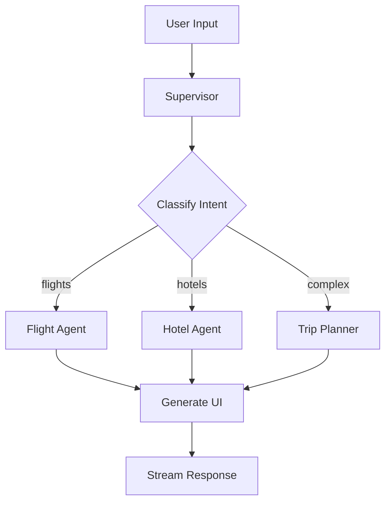

# 🤖 Arquitetura do Agente

## 🏗️ Multi-Agent System

Sistema baseado em **Supervisor Pattern** com agentes especializados:ra do Agente LangGraph

## Visão Geral

O sistema implementa uma arquitetura **multi-agent** usando LangGraph, onde diferentes agentes especializados colaboram através### Performance Characteristics

### Throughput (Implementado)

- **Concurrent Users**: Suporte básico para múltiplos threads
- **Message Processing**: Processamento sequencial por thread
- **Resource Usage**: Otimizado para desenvolvimento local

### Latência (Ver error-handling.md para detalhes)

- **Simulação**: 300-1200ms conforme resilience.tservisor\*\* que roteia requests baseado na classificação de intenção do usuário.

## 🎯 Nós Principais

### 1. **Supervisor Node** (`classify.ts`)

```typescript
// Classifica intenção e roteia para agente correto
const supervisor = (state: AgentState) => {
  const classification = classifyUserIntent(state.messages);
  return {
    next: classification.agent, // "flights", "hotels", "trip-planner"
    confidence: classification.confidence,
  };
};
```

**Responsabilidades:**

- 🔍 Análise de linguagem natural do input do usuário
- 🎯 Classificação de intenção: `FLIGHT_SEARCH`, `HOTEL_SEARCH`, `BOOKING_REQUEST`
- 📍 Roteamento para agente especializado apropriado
- ⚡ Failover para trip-planner genérico em casos ambíguos

### 2. **Flight Agent** (`nodes/tools.ts`)

```typescript
const flightAgent = async (state: AgentState) => {
  if (state.intent === "FLIGHT_SEARCH") {
    return await handleFlightSearch(state);
  }
  if (state.intent === "FLIGHT_BOOKING") {
    return await handleFlightBooking(state);
  }
  // ... outras operações
};
```

**Capabilities:**

- ✈️ Busca de voos com filtros (origem, destino, datas, passageiros)
- 💳 Processo de reserva com validação de dados
- ❌ Cancelamento de reservas existentes
- 🎨 Renderização de UI generativa (FlightsList, BookingForm)

### 3. **Hotel Agent** (similar structure)

**Capabilities:**

- 🏨 Busca de acomodações por localização e período
- 🛏️ Detalhes de quartos, políticas, amenities
- 📅 Gestão de reservas hoteleiras
- 🎨 UI Components específicos (HotelsList, RoomDetails)

### 4. **Trip Planner Agent**

**Capabilities:**

- 🧠 Coordenação multi-modal (voos + hotéis + atividades)
- 📋 Geração de itinerários completos
- 💡 Sugestões baseadas em preferências do usuário
- 🔄 Fallback para requests não classificados

## 🔄 Fluxo de Estado

### Estado Compartilhado (`types.ts`)

```typescript
interface AgentState {
  messages: BaseMessage[];
  intent: IntentType;
  context: {
    origin?: string;
    destination?: string;
    dates?: DateRange;
    passengers?: number;
    budget?: number;
  };
  artifacts?: UIArtifact[];
  next: string;
}
```

### Transição de Estados



## 🛠️ Tools Integration

### Tool Calling Pattern

```typescript
// Cada agente tem acesso a tools específicas
const flightTools = [
  {
    name: "listFlights",
    description: "Search for flights between airports",
    parameters: FlightSearchSchema,
  },
  {
    name: "bookFlight",
    description: "Book a specific flight",
    parameters: FlightBookingSchema,
  },
];
```

### Execution Flow

1. **Intent Classification**: Supervisor analisa input
2. **Agent Selection**: Roteia para agente especializado
3. **Tool Calling**: Agente chama tools apropriadas
4. **UI Generation**: Produz componentes React específicos
5. **State Update**: Atualiza estado compartilhado
6. **Stream Response**: Envia UI e dados para frontend

## 🎨 Generative UI Pipeline

### Component Generation

```typescript
const generateFlightUI = (flights: Flight[]) => {
  return {
    type: "react",
    component: "FlightsList",
    props: {
      flights,
      onBook: handleBooking,
      loading: false,
    },
  };
};
```

### Streaming Architecture

- 🔄 **Incremental Updates**: UI atualizada conforme dados chegam
- ⚡ **Real-time Feedback**: Loading states e progress indicators
- 🎯 **Component Hydration**: Props injetadas dinamicamente
- 🔧 **Event Handling**: Callbacks para interações do usuário

## 🧠 Decision Logic

### Intent Classification Algorithm

```typescript
const classifyIntent = (message: string): IntentClassification => {
  const patterns = {
    FLIGHT_SEARCH: /\b(voo|flight|voar|CNF|GRU|airport)\b/i,
    HOTEL_SEARCH: /\b(hotel|hospedagem|quarto|acomodação)\b/i,
    BOOKING: /\b(reservar|booking|confirmar|pnr)\b/i,
    CANCEL: /\b(cancelar|cancel|estornar)\b/i,
  };

  // Scoring baseado em matches + contexto anterior
  const scores = calculateIntentScores(message, patterns);
  return getBestMatch(scores);
};
```

### Confidence Thresholds

- **High Confidence (>0.8)**: Roteia diretamente para agente
- **Medium Confidence (0.5-0.8)**: Agente + confirmação
- **Low Confidence (<0.5)**: Trip Planner genérico

## 🔍 Error Handling & Fallbacks

### Agent Failure Recovery

```typescript
const executeWithFallback = async (agent: Agent, state: AgentState) => {
  try {
    return await agent.execute(state);
  } catch (error) {
    console.warn(`Agent ${agent.name} failed:`, error);
    // Fallback para trip-planner genérico
    return await tripPlannerAgent.execute(state);
  }
};
```

### Tool Execution Resilience

- ⚡ **Retry Logic**: 3 tentativas com backoff exponencial
- 🔄 **Graceful Degradation**: UI parcial se dados incompletos
- 📱 **User Feedback**: Toast notifications para erros
- 🎯 **Context Preservation**: Estado mantido entre tentativas

## 📊 Performance Characteristics

### Latência Típica

- **Intent Classification**: ~50-100ms
- **Tool Execution**: 300-1200ms (simulado)
- **UI Generation**: ~10-50ms
- **Total Response Time**: ~400-1400ms

### Throughput

- **Concurrent Users**: Suporte para múltiplos threads
- **Message Processing**: ~10-20 msgs/sec por agente
- **Resource Usage**: Otimizado para baixo memory footprint

## 🔧 Configuração e Deployment

### Environment Variables

```bash
# LangGraph Configuration
LANGCHAIN_API_KEY=your_key
LANGSMITH_PROJECT=trip-planner

# Agent Behavior
CLASSIFICATION_THRESHOLD=0.6
TOOL_TIMEOUT=5000
MAX_RETRIES=3
```

### Production Considerations

- 🔐 **Rate Limiting**: Por usuário e por agente
- 📊 **Monitoring**: LangSmith tracing habilitado
- 🚀 **Scaling**: Horizontal scaling via worker processes
- 💾 **State Persistence**: Redis para sessões longas

---

**Próximo**: [Tools Specification](./tools-specification.md) - Documentação detalhada de todas as tools implementadas.
