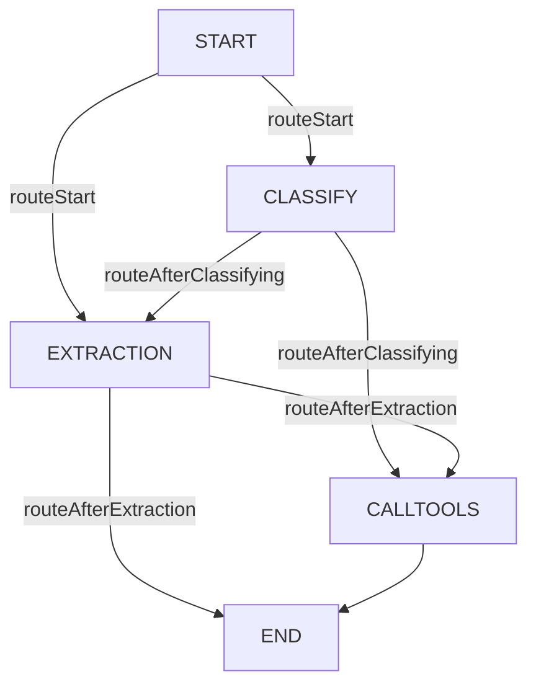

# Documentação do Trip Planner Agent

## Visão Geral do Projeto

Este projeto implementa um sistema de agentes usando **LangGraph.js** para planejamento de viagens. O foco principal está no **Trip Planner Agent**, que gerencia todo o fluxo de planejamento de viagens através de **classificação de relevância**, **extração de dados estruturados** e **execução de ferramentas especializadas**.

## Arquitetura Geral

### Estrutura do Projeto
```
src/
├── agent/
│   └── trip-planner/
│       ├── index.ts          # Configuração do grafo e roteamento
│       ├── types.ts          # Definições de tipos TypeScript
│       ├── nodes/            # Nós do grafo de execução
│       │   ├── classify.ts   # Classificação de relevância
│       │   ├── extraction.ts # Extração de informações
│       │   └── tools.ts      # Execução de ferramentas
│       └── utils/
│           └── get-accommodations.ts # Utilitários para acomodações
├── agent-uis/
│   └── trip-planner/         # Interfaces visuais específicas
│       ├── accommodations-list/
│       └── restaurants-list/
└── components/ui/            # Componentes de interface reutilizáveis
```

## Fluxo do Trip Planner Agent

### Estado do Agente
```typescript
interface TripPlannerState {
  messages: Array<Message>;        // Histórico da conversa
  ui: Array<UIComponent>;          // Componentes de interface
  timestamp: number;               // Timestamp da última atualização
  tripDetails: TripDetails | undefined; // Dados estruturados da viagem
}

interface TripDetails {
  location: string;         // Destino da viagem
  startDate: Date;         // Data de início
  endDate: Date;           // Data de término
  numberOfGuests: number;  // Número de hóspedes
}
```

### 1. **Roteamento Inicial (START → classify/extraction)**
- **Responsabilidade**: Determinar o primeiro nó a ser executado
- **Localização**: `src/agent/trip-planner/index.ts` - função `routeStart()`
- **Lógica de Roteamento**:
  - Se `tripDetails` não existe → **extraction**
  - Se `tripDetails` existe → **classify**

### 2. **Classificação de Relevância (classify)**
- **Responsabilidade**: Verificar se os dados de viagem existentes ainda são relevantes
- **Localização**: `src/agent/trip-planner/nodes/classify.ts`
- **Implementação**:
  - Usa GPT-4o para analisar se tripDetails ainda são relevantes
  - Compara dados existentes com a nova solicitação do usuário
  - Identifica mudanças em localização, datas ou número de hóspedes
- **Saídas**:
  - Se **irrelevante** → limpa `tripDetails` (undefined)
  - Se **relevante** → mantém estado atual
- **Próximo nó**: 
  - Se tripDetails for undefined → **extraction**
  - Se tripDetails existir → **callTools**

### 3. **Extração de Dados (extraction)**
- **Responsabilidade**: Extrair informações estruturadas da conversa
- **Localização**: `src/agent/trip-planner/nodes/extraction.ts`
- **Implementação**:
  - Usa GPT-4o com schema Zod para extrair dados estruturados
  - Calcula datas padrão se não fornecidas (4-5 semanas no futuro)
  - Define número padrão de hóspedes (2) se não especificado
  - Valida se localização foi fornecida (obrigatório)
- **Campos Extraídos**:
  - `location` (obrigatório)
  - `startDate` (opcional, com padrões calculados)
  - `endDate` (opcional, com padrões calculados) 
  - `numberOfGuests` (opcional, padrão: 2)
- **Lógica de Datas**:
  - Ambas undefined → início: +4 semanas, fim: +5 semanas
  - Só início → fim: início +1 semana
  - Só fim → início: fim -1 semana
- **Próximo nó**:
  - Se extração falhou (sem localização) → **END**
  - Se extração bem-sucedida → **callTools**

### 4. **Execução de Ferramentas (callTools)**
- **Responsabilidade**: Executar ferramentas apropriadas e gerar UI
- **Localização**: `src/agent/trip-planner/nodes/tools.ts`
- **Ferramentas Disponíveis**:
  - **`list-accommodations`**: Lista acomodações para a viagem
  - **`list-restaurants`**: Lista restaurantes para a viagem
- **Implementação**:
  - Usa GPT-4o para decidir quais ferramentas chamar
  - Gera componentes UI baseados nas ferramentas executadas
  - Integra com sistema de UI tipada do LangGraph
- **Componentes UI Gerados**:
  - `accommodations-list`: Lista de acomodações
  - `restaurants-list`: Lista de restaurantes
- **Próximo nó**: **END**

## Detalhamento dos Nós

### Nó de Classificação (`classify.ts`)
```typescript
// Responsabilidades principais:
// 1. Verificar relevância dos tripDetails existentes
// 2. Detectar mudanças na solicitação do usuário
// 3. Limpar dados irrelevantes
// 4. Manter dados relevantes

// Schema de saída:
{
  isRelevant: boolean // Se os dados atuais ainda são relevantes
}

// Prompt principal:
// - Compara tripDetails existentes com nova conversa
// - Identifica mudanças em localização, datas, hóspedes
// - Define como irrelevante se há mudanças significativas
```

### Nó de Extração (`extraction.ts`)
```typescript
// Responsabilidades principais:
// 1. Extrair dados estruturados da conversa
// 2. Aplicar valores padrão para campos opcionais
// 3. Validar campos obrigatórios (localização)
// 4. Calcular datas inteligentemente

// Schema de entrada:
{
  location: string,           // Obrigatório
  startDate?: string,        // YYYY-MM-DD format
  endDate?: string,          // YYYY-MM-DD format  
  numberOfGuests?: number    // Padrão: 2
}

// Função calculateDates():
// - Calcula datas padrão baseado no que foi fornecido
// - Garante consistência temporal
```

### Nó de Ferramentas (`tools.ts`)
```typescript
// Responsabilidades principais:
// 1. Decidir quais ferramentas executar
// 2. Chamar ferramentas apropriadas
// 3. Gerar componentes UI para resultados
// 4. Integrar com sistema de UI tipada

// Ferramentas disponíveis:
const ACCOMMODATIONS_TOOLS = [
  "list-accommodations",  // → accommodations-list UI
  "list-restaurants"      // → restaurants-list UI
]

// Fluxo de execução:
// 1. LLM decide quais ferramentas chamar
// 2. Para cada tool call, gera componente UI correspondente
// 3. Push components para ui.items
```

## Roteamento e Fluxo de Controle

### Grafo de Estados


### Funções de Roteamento

#### `routeStart(state)`
```typescript
// Se não tem tripDetails → precisa extrair dados
if (!state.tripDetails) return "extraction";
// Se tem tripDetails → precisa verificar relevância  
return "classify";
```

#### `routeAfterClassifying(state)`
```typescript
// Se classify limou tripDetails (irrelevante) → precisa extrair novos dados
if (!state.tripDetails) return "extraction";
// Se manteve tripDetails (relevante) → pode executar ferramentas
return "callTools";
```

#### `routeAfterExtraction(state)`
```typescript
// Se extraction falhou → não pode continuar
if (!state.tripDetails) return END;
// Se extraction sucedeu → pode executar ferramentas
return "callTools";
```

## Componentes de Interface

### Lista de Acomodações (`accommodations-list/`)
- **Localização**: `src/agent-uis/trip-planner/accommodations-list/`
- **Responsabilidade**: Apresentar opções de hospedagem
- **Props recebidas**: 
  - `toolCallId`: ID da chamada da ferramenta
  - Dados das acomodações via `getAccommodationsListProps()`

### Lista de Restaurantes (`restaurants-list/`)
- **Localização**: `src/agent-uis/trip-planner/restaurants-list/`
- **Responsabilidade**: Apresentar opções gastronômicas
- **Props recebidas**:
  - `tripDetails`: Dados estruturados da viagem

## Utilitários

### `get-accommodations.ts`
- **Responsabilidade**: Gerar props para componente de acomodações
- **Localização**: `src/agent/trip-planner/utils/get-accommodations.ts`
- **Função**: Transformar `TripDetails` em props para UI de acomodações

### Sistema de Mensagens
- **Format Messages**: `src/agent/utils/format-messages.ts`
- **Responsabilidade**: Formatar histórico de conversa para LLMs

## Considerações para Desenvolvimento

### Pontos de Extensão
1. **Novas Ferramentas**: 
   - Adicionar em `ACCOMMODATIONS_TOOLS` array
   - Implementar lógica de execução em `callTools()`
   - Criar componente UI correspondente

2. **Novos Campos de Extração**: 
   - Expandir schema Zod em `extraction.ts`
   - Atualizar interface `TripDetails` em `types.ts`
   - Modificar lógica de valores padrão

3. **Novas Condições de Roteamento**:
   - Modificar funções de roteamento em `index.ts`
   - Adicionar novos nós se necessário

### Padrões Estabelecidos
- **Estado Imutável**: Cada nó retorna updates, não modifica estado diretamente
- **Validação Rigorosa**: Usar Zod schemas para validação de dados
- **Error Handling**: Throws em casos de erro irrecuperável
- **UI Tipada**: Sistema de componentes tipados via LangGraph SDK

### Debugging e Monitoramento
- **LangSmith Tags**: `{ tags: ["langsmith:nostream"] }` para logging
- **Tool Call IDs**: Rastreamento de execução de ferramentas
- **Estado Intermediário**: Logs automáticos do LangGraph entre nós

### Fluxos de Erro
- **Classify sem tripDetails**: Retorna `{}` (sem mudança de estado)
- **Extraction sem localização**: Solicita clarificação ao usuário
- **Tools sem tripDetails**: Throw error (não deveria acontecer)
- **Tools sem tool calls**: Throw error (LLM não selecionou ferramenta)

## Integração com Sistema Maior

### Dependências Externas
- **OpenAI GPT-4o**: Para processamento de linguagem natural
- **LangGraph SDK**: Para orquestração do grafo de estados
- **Zod**: Para validação e tipagem de dados
- **React UI Server**: Para componentes de interface tipados

### Extensibilidade
O sistema foi projetado para ser facilmente extensível:
- Novos tipos de viagem podem ser adicionados via classificação
- Novas ferramentas podem ser integradas no sistema existente
- Novos campos de dados podem ser extraídos sem quebrar o fluxo
- Novas UIs podem ser adicionadas seguindo o padrão estabelecido